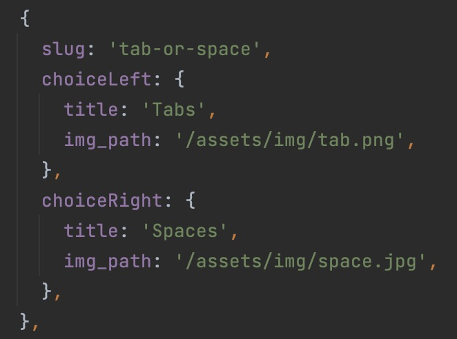

# Choiceof.dev

Developers have to cope with pretty hard choices every day. This is a collection of the most complex and funny choices. What will be yours?

<p style="text-align: center;"></p>

🗺 **By the developers for the developers**

## How to add a question to choiceof.dev

As it is a project by the developers for the developers, we want to make the act to contribute a cool and fun way to learn how to contribute to open source project.
To add a question, you must clone the project locally, built it, updating one file and adding your two images.

Just a quick reminder, the project is supposed to be funny. Therefore, questions must be... funny. If you are creating a question that is not extremely funny in the choice, at least, try to find funny images to illustrate it.

The file to edit is: `apps/devchoices-next/public/assets/data/questions.ts`
<p style="text-align: center;"></p>

You will find there a list of questions, with a slug, a title, a description, the right and left choices and their respective images.
You can add a question at the end of the list, or in the middle, it doesn't matter.
Then you have to add two images in the folder ``apps/devchoices-next/public/assets/img`` with the name you have precise in the other file.

Then you can run the project locally and check if everything is working fine. You can test your question directly by going to the following url:
`localhost:4200/question/your-slug`

If you like the result, it's time to generate the preview of this question for social networks.
To do this run the command:

``pnpm ts-node --project tsconfig-generator.json preview-generator.ts``

if you want for any reason to regenerate all the previews, you can run the command:

``pnpm ts-node --project tsconfig-generator.json preview-generator.ts --override``

Now you are ready to submit your PR. We will review it and if everything is fine, and the joke is fun, we will merge it and your question will be available on the website 🎉


## How to contribute to the core project and adding features

In the issues of the repository, you will see many open tickets. You can take one of them if you fancy and propose your solution on a PR.
You can also create issues by yourself if you experienced a bug or if you have an idea for a new feature.


## Technologies

The project is modernised copy of his little brother [choixdemerde.fr](https://choixdemerde.fr)
It is built with:
- [Nx](https://nx.dev/)
- [Next.js](https://nextjs.org/)
- [Tailwind](https://tailwindcss.com/)
- [Storybook](https://storybook.js.org/)
- [Jest](https://jestjs.io/fr/)
- [Testing Library](https://testing-library.com/)

There are also many [community plugins](https://nx.dev/community) you could add.

## Run the project locally

Clone the repository, install the dependencies and run the project:

```bash
  pnpm install
  npx nx serve
```
You should see this:
<p style="text-align: center;"></p>

And going on `localhost:4200` you should see the project running. 

## Run the storybook

If you want to work on components, on design system, or on a dedicated environment without bore effects of the app, you can run the storybook:

```bash
 nx run shared-ui:storybook
```
You should see this in your terminal
<p style="text-align: center;"></p>

and on `localhost:4400` you should see the storybook running.
<p style="text-align: center;"></p>

## Credits

This open source project and this website have been created by Benjamin Code to celebrate his 100k subscribers on YouTube.
The project is inspired by [choixdemerde.fr](https://choixdemerde.fr) which is a project also created by [Benjamin Code](https://twitter.com/benjamincode) and that costed him a lot of money back in the day... If you want to learn more about this story and how a big buzz on your funny side project can ruins you, you will find [this article on Medium](https://medium.com/@benjamindebonmountain/choixdemerde-fr-le-buzz-couteux-6a46d3d6a480)

"The story of choix de merde is terrible. It costed me a lot of time and money and never brought me anything. But the stories about this catastrophic development made me starts a YouTube channel and it has been so far the best experience of my life. For the 100k subscribers I wanted to bring back some light on this story and complete the loop"
– Benjamin Code
