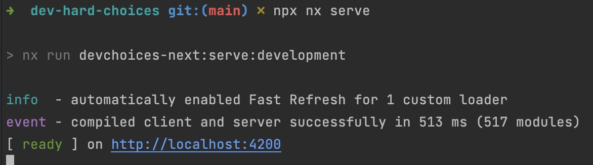
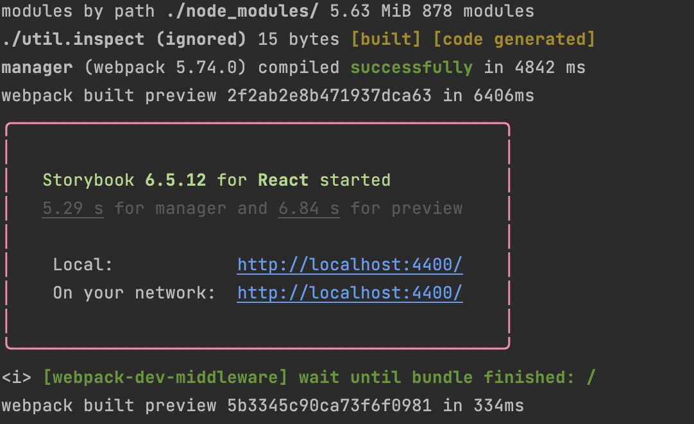
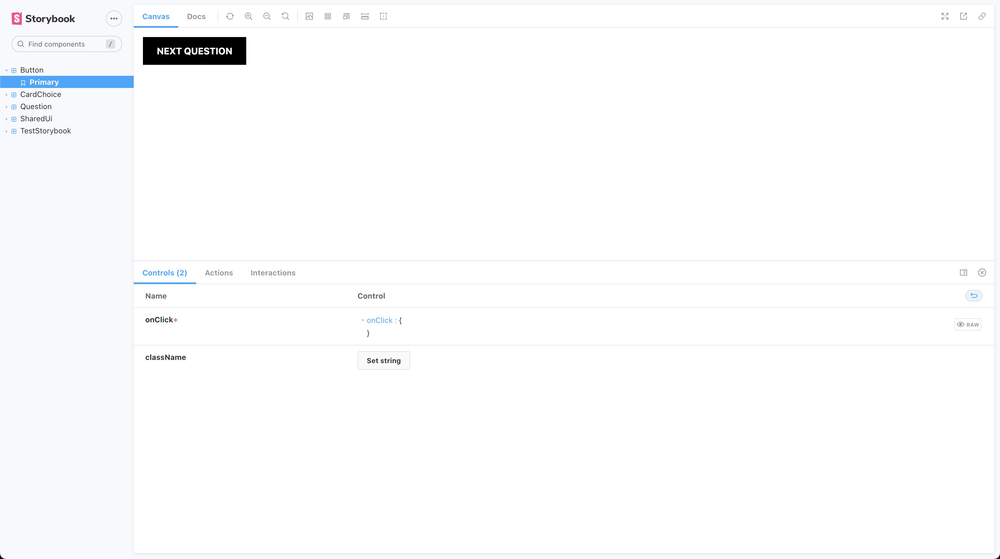

# Choiceof.dev

Developers have to cope with pretty hard choices every day. This is a collection of the most complex and funny choices. What will be yours?

<p style="text-align: center;"></p>

🗺 **By the developers for the developers**

## Technologies

The project is modernised copy of his little brother [choixdemerde.fr](https://choixdemerde.fr)
It is built with:
- [Nx](https://nx.dev/)
- [Next.js](https://nextjs.org/)
- [Tailwind](https://tailwindcss.com/)
- [Storybook](https://storybook.js.org/)
- [Jest](https://jestjs.io/fr/)
- [Testing Library](https://testing-library.com/)

There are also many [community plugins](https://nx.dev/community) you could add.

## Run the project locally

Clone the repository, install the dependencies and run the project:

```bash
  yarn install
  npx nx serve
```
You should see this:
<p style="text-align: center;"></p>

And going on `localhost:4200` you should see the project running. 

## Run the storybook

If you want to work on components, on design system, or on a dedicated environment without bore effects of the app, you can run the storybook:

```bash
 nx run shared-ui:storybook
```
You should see this in your terminal
<p style="text-align: center;"></p>

and on `localhost:4400` you should see the storybook running.
<p style="text-align: center;"></p>

## How to add a question to choiceof.dev

As it is a project by the developers for the developers, we want to make the act to contribute a cool and fun way to learn how to contribute to open source project.
To add a question, you must clone the project locally, built it, updating one file and adding your two images.
The file to edit is: `libs/shared/assets/src/data/questions.ts`

You will find there a list of questions, with a slug, a title, a description, the right and left choices and their respective images.
You can add a question at the end of the list, or in the middle, it doesn't matter.
Then you have to add two images in the folder ``libs/shared/assets/src/data/questions.ts`` with the name you have precise in the other file.

Then you can run the project locally and check if everything is working fine. You can test your question directly by going to the following url:
`localhost:4200/question/your-slug`

## Code scaffolding

Run `nx g @nrwl/react:component my-component --project=my-app` to generate a new component.

## Build

Run `nx build my-app` to build the project. The build artifacts will be stored in the `dist/` directory. Use the `--prod` flag for a production build.

## Running unit tests

Run `nx test my-app` to execute the unit tests via [Jest](https://jestjs.io).

Run `nx affected:test` to execute the unit tests affected by a change.

## Running end-to-end tests

Run `nx e2e my-app` to execute the end-to-end tests via [Cypress](https://www.cypress.io).

Run `nx affected:e2e` to execute the end-to-end tests affected by a change.

## Understand your workspace

Run `nx graph` to see a diagram of the dependencies of your projects.

## Further help

Visit the [Nx Documentation](https://nx.dev) to learn more.


## ☁ Nx Cloud

### Distributed Computation Caching & Distributed Task Execution

<p style="text-align: center;"></p>

Nx Cloud pairs with Nx in order to enable you to build and test code more rapidly, by up to 10 times. Even teams that are new to Nx can connect to Nx Cloud and start saving time instantly.

Teams using Nx gain the advantage of building full-stack applications with their preferred framework alongside Nx’s advanced code generation and project dependency graph, plus a unified experience for both frontend and backend developers.

Visit [Nx Cloud](https://nx.app/) to learn more.
